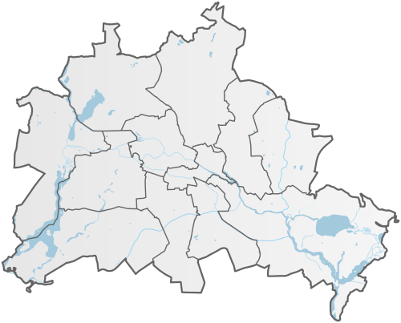

<!-- PROJECT SHIELDS -->

[![Contributors][contributors-shield]][contributors-url]
[![Forks][forks-shield]][forks-url]
[![Stargazers][stars-shield]][stars-url]
[![Issues][issues-shield]][issues-url]
[![MIT License][license-shield]][license-url]
[![LinkedIn][linkedin-shield]][linkedin-url]


<!-- PROJECT LOGO -->
<br />
<p align="center">
  <a href="https://github.com/guerre381/udacity_project_1">
    
  </a>

  <h3 align="center">Airbnb in Berlin</h3>

  <p align="center">
    UDACITY online training in Data Science  
    <br />
    <a href="https://github.com/guerre381/udacity_project_1">View Demo</a>
    ·
    <a href="https://github.com/guerre381/udacity_project_1/issues">Report Bug</a>
    ·
    <a href="https://github.com/guerre381/udacity_project_1/issues">Request Feature</a>
  </p>
</p>


<!-- TABLE OF CONTENTS -->
<details open="open">
  <summary><h2 style="display: inline-block">Table of Contents</h2></summary>
  <ol>
    <li><a href="#about-the-project">About The Project</a></li>
    <li><a href="#built-with">Built With</a></li>
    <li><a href="#getting-started">Getting Started</a></li>
    <li><a href="#prerequisites">Prerequisites</a></li>
    <li><a href="#installation">Installation</a></li>
    <li><a href="#contributing">Contributing</a></li>
    <li><a href="#license">License</a></li>
    <li><a href="#contact">Contact</a></li>
  </ol>
</details>


<!-- ABOUT THE PROJECT -->
## About The Project

In this data science project, we intend to answer couple of questions out of Berlin s airbnb data from Kaggle.
The intention is to get insight for someone interested in the airbnb business. 
The topics covered are:

 * prefered locations
 * pricing
 * normals and professionals host distinction 
 * communication with guests


## Built With
There is only one jupyter notebook. Yet, the project is fueld with data to be downloaded form kaggle.
Data should be dropped in "data" folder, already provided with a map of Berlin stored into a json file.

The code is written in Python 3.8 in a jupyter notebook. 
It relies mainly on the following libraries:

* [spacy 3.0.1](https://spacy.io/)
* [spacy-langdetect 0.1.2](https://spacy.io/universe/project/spacy-langdetect)
* [scikit-learn 0.24.1](https://scikit-learn.org/stable/)
* [geopandas 0.8.2 ](https://geopandas.org/install.html)
* [geoplot 0.4.1](https://residentmario.github.io/geoplot/index.html)
* [pandas 1.2.1](https://pandas.pydata.org/)
* [seaborn 0.11.1](https://seaborn.pydata.org/)


<!-- GETTING STARTED -->
## Getting Started

To get a local copy up and running follow these simple steps:
1. create a virtual environment for Python 3.8 or higher.
2. install all required libraries
2. clone udacity_project_1sitory
3. copy csv files from kaggle in data folder from local repository
4. open jupyter notebook from virtual environment command prompt
	
<!-- PREREQUISITES -->
## Prerequisites

* pull [data](https://www.kaggle.com/brittabettendorf/berlin-airbnb-data) from Kaggle
* load required libraries

<!-- INSTALLATION -->
## Installation

Clone the udacity_project_1 repository
   ```sh
   git clone https://github.com/guerre381/udacity_project_1.git
   ```

<!-- CONTRIBUTING -->
## Contributing

If you want to continue the analysis and get more from the data, your contribution would be appreciated.

1. Fork the Project
2. Create your Feature Branch (`git checkout -b feature/AmazingFeature`)
3. Commit your Changes (`git commit -m 'Add some AmazingFeature'`)
4. Push to the Branch (`git push origin feature/AmazingFeature`)
5. Open a Pull Request


<!-- CONTACT -->
## Contact

Romain Guerre - guerre_romain38@hotmail.com

Project Link: [https://github.com/guerre381/udacity_project_1](https://github.com/guerre381/udacity_project_1)


[contributors-shield]: https://img.shields.io/github/contributors/guerre381/udacity_project_1.svg?style=for-the-badge
[contributors-url]: https://github.com/guerre381/udacity_project_1/graphs/contributors
[forks-shield]: https://img.shields.io/github/forks/guerre381/udacity_project_1.svg?style=for-the-badge
[forks-url]: https://github.com/guerre381/udacity_project_1/network/members
[stars-shield]: https://img.shields.io/github/stars/guerre381/udacity_project_1.svg?style=for-the-badge
[stars-url]: https://github.com/guerre381/udacity_project_1/stargazers
[issues-shield]: https://img.shields.io/github/issues/guerre381/udacity_project_1.svg?style=for-the-badge
[issues-url]: https://github.com/guerre381/udacity_project_1/issues
[license-shield]: https://img.shields.io/github/license/guerre381/udacity_project_1.svg?style=for-the-badge
[license-url]: https://github.com/guerre381/udacity_project_1/blob/master/LICENSE.txt
[linkedin-shield]: https://img.shields.io/badge/-LinkedIn-black.svg?style=for-the-badge&logo=linkedin&colorB=555
[linkedin-url]: https://www.linkedin.com/in/romain-guerre-14b4a891/
